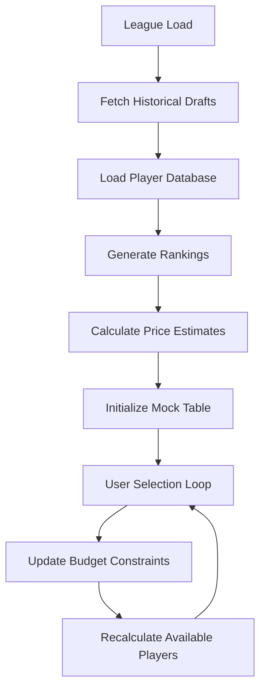

# Draft Analysis Features

## Overview
Draft Builder's core draft analysis functionality centers around mock draft simulation, player valuation, and data-driven draft preparation. The system combines historical draft data, current player rankings, and sophisticated algorithms to help users make informed draft decisions.

## Mock Draft Engine

### Architecture
The mock draft engine is implemented in `src/app/league/[leagueID]/mocks/` and consists of several key components:

#### Core Components
- **MockDraft.tsx**: Main container component that orchestrates data fetching and state management
- **MockTable.tsx**: Interactive player selection and budget tracking interface
- **MockRosterEntry.tsx**: Individual roster position management
- **SearchSettings.tsx**: Player filtering and search controls
- **EstimationSettings.tsx**: Price prediction and ranking weight configuration

### Data Flow


### Key Features

#### 1. Player Database Construction
```typescript
function buildPlayerDb(platform: Platform, players: Player[], rankings: Rankings[], lineupSettings: RosterSettings, scoringType: ScoringType): MockPlayer[]
```

**Process**:
1. **Eligibility Filtering**: Removes players not ranked by any ranking system
2. **Position Validation**: Ensures players are eligible for league roster positions
3. **Data Enhancement**: Adds suggested costs from platform data when available

**Output**: Standardized `MockPlayer[]` array with platform-agnostic player data

#### 2. Real-time Player Ranking
```typescript
function rankPlayers(players: MockPlayer[], rankings: Rankings): RankedPlayer[]
```

**Features**:
- **Multiple Ranking Sources**: Supports platform rankings and external sources (Google Sheets)
- **Overall Rankings**: 0-indexed overall player rankings
- **Positional Rankings**: Position-specific rankings (QB1, RB12, etc.)
- **Unranked Handling**: Filters out players without ranking data

#### 3. Price Prediction Engine
```typescript
function predictCostWithSettings(player: RankedPlayer, settings: EstimationSettingsState, draftHistory: Map<SeasonId, DraftAnalysis>): number
```

**Algorithm Components**:
- **Multi-year Analysis**: Averages predictions across selected historical seasons
- **Weighted Predictions**: Combines overall rank and positional rank predictions
- **Exponential Regression**: Uses exponential curve fitting for price prediction
- **Floor Protection**: Ensures minimum $1 cost for all players

**Configuration Options**:
- **Year Selection**: Choose which historical drafts to include in analysis
- **Rank Weighting**: Balance between overall rank (0-100%) and positional rank (0-100%)

## Player Ranking Algorithms

### Ranking Data Sources

#### 1. Platform Rankings
**ESPN**: Uses platform auction values when available
**Sleeper**: Uses platform suggested costs
```typescript
function rankByPlatformPrice(platform: Platform, players: Player[], scoringType: ScoringType): Rankings
```

#### 2. External Rankings
**Google Sheets Integration**: Real-time ADP data from external sources
**Multiple Formats**: Supports Standard, PPR, Half-PPR, and Superflex formats

#### 3. Ranking Normalization
All ranking sources are normalized to a common format:
```typescript
type Rankings = {
    platform: Platform;
    overall: Map<string, number>;          // playerId -> overall rank
    positional: Map<string, Map<string, number>>; // position -> playerId -> position rank
}
```

### Ranking Selection and Management
Users can choose between available ranking sources via dropdown:
- **Platform Rankings**: "Platform" or "Rnk" 
- **External Sources**: Named ranking sets with short names for display

## Value Calculation Methods

### Exponential Price Prediction
The core valuation engine uses exponential regression to predict auction prices:

```typescript
function predictExponential(rank: number, coefficients: ExponentialCoefficients): number
```

**Mathematical Model**: `price = a * e^(b * rank)`
- **a**: Base price coefficient (y-intercept)
- **b**: Decay rate (negative value indicating price drop with rank)

### Multi-Factor Value Calculation

#### 1. Overall vs Positional Weighting
```typescript
function weightedPrediction(player: RankedPlayer, analysis: DraftAnalysis, weight: number): number
```

**Formula**: `final_price = (1 - w) * overall_prediction + w * position_prediction`
- **w**: Position weight (0-100%)
- **overall_prediction**: Price based on overall player rank
- **position_prediction**: Price based on positional rank (QB3, RB15, etc.)

#### 2. Historical Data Integration
```typescript
function analyzeDraft(draftedPlayers: DraftedPlayer[]): DraftAnalysis
```

**Process**:
1. **Sort by Price**: Orders picks from highest to lowest price
2. **Regression Analysis**: Fits exponential curves to price data
3. **Position-Specific Analysis**: Creates separate curves for each position
4. **Coefficient Storage**: Saves curve parameters for prediction

### Budget Analysis Features

#### 1. Real-time Budget Tracking
```typescript
function calculateAmountSpent(costEstimator: CostPredictor, rosterSpots: number, selectedPlayers: RankedPlayer[], adjustments: Map<string, number>): number
```

**Components**:
- **Selected Player Costs**: Sum of estimated costs for drafted players
- **Unselected Spots**: Minimum $1 per remaining roster spot
- **Cost Adjustments**: Manual price modifications by position

#### 2. Budget Constraint Validation
The system enforces auction budget limits by:
- **Real-time Updates**: Recalculating available budget after each selection
- **Player Filtering**: Hiding unaffordable players based on remaining budget
- **Warning Systems**: Visual indicators when approaching budget limits

#### 3. Position-Based Budget Analysis
```typescript
setPositionallyAvailablePlayers(position, displayRankedPlayers.filter(includePlayer(settingsWithPosition)))
```

**Features**:
- **Position Targeting**: Separate player pools for each roster position
- **Availability Filtering**: Shows only players the user can afford and need
- **Multi-position Eligibility**: Handles players eligible for multiple positions (FLEX, etc.)

## Position-Based Analytics

### Position Scarcity Analysis
The system calculates position-specific value patterns:

#### 1. Positional Price Curves
Each position has its own exponential price decay curve:
- **QB**: Typically flatter curve (less price variation between ranks)
- **RB**: Steeper curve (high-end RBs command premium prices)
- **WR**: Moderate curve with depth considerations
- **TE**: Often very steep curve (elite TEs vs replacement level)

#### 2. Replacement Level Calculations
The prediction engine identifies value breakpoints:
- **Tier Boundaries**: Where significant price drops occur
- **Value vs Cost**: Optimal spending points for each position
- **Opportunity Cost**: Value lost by waiting vs reaching for positions

### Position Requirements Integration
The system enforces league roster construction rules:

```typescript
positions: RosterSettings  // e.g., {"QB": 1, "RB": 2, "WR": 2, "TE": 1, "FLEX": 1}
```

**Features**:
- **Mandatory Positions**: Ensures all required positions are filled
- **Flexible Positions**: Handles FLEX spots that can be filled by multiple position types
- **Bench Considerations**: Accounts for bench depth requirements

### Advanced Position Analytics

#### 1. Multi-Position Players
Players eligible for multiple positions (e.g., RB/WR, WR/TE):
- **Positional Rankings**: Ranked within each eligible position
- **Value Optimization**: System considers best positional value for draft strategy
- **Roster Flexibility**: FLEX-eligible players provide additional roster construction options

#### 2. Position-Specific Search Filters
```typescript
// SearchSettings.tsx
const settingsWithPosition = { ...searchSettings, positions: [position] };
nextPositionallyAvailablePlayers.set(position, displayRankedPlayers.filter(includePlayer(settingsWithPosition)));
```

**Capabilities**:
- **Position Isolation**: View players for specific roster spots
- **Multi-Position Selection**: Filter by combinations of positions
- **Dynamic Filtering**: Real-time updates based on budget and availability

## Historical Draft Analysis

### Draft Data Processing
```typescript
function analyzeDraft(draftedPlayers: DraftedPlayer[]): DraftAnalysis
```

**Analysis Components**:
1. **Overall Price Curve**: Exponential regression for all picks regardless of position
2. **Position-Specific Curves**: Separate analysis for QB, RB, WR, TE, etc.
3. **Price Point Identification**: Key value thresholds and tier breaks

### Multi-Season Integration
The system supports analysis across multiple seasons:
- **Season Selection**: Users choose which years to include in predictions
- **Weighted Averaging**: Combines predictions from multiple seasons
- **Trend Analysis**: Identifies changing value patterns over time

### Performance Validation
```typescript
function meanSquaredError<T>(data: T[], actual: (d: T) => number, predicted: (d: T) => number): number
```

**Accuracy Metrics**:
- **Mean Squared Error**: Measures prediction accuracy against actual results
- **Top-50 Analysis**: Focuses accuracy measurement on early-round picks
- **Position-Specific Error**: Tracks prediction quality by position

## Integration Points

### External Data Sources
- **Platform APIs**: ESPN and Sleeper player data and auction values
- **Google Sheets**: Real-time ADP and ranking data
- **Manual Adjustments**: User-defined price modifications

### State Management
- **LocalStorage Persistence**: Saves draft progress and settings
- **Real-time Updates**: Immediate recalculation on user actions
- **Session Recovery**: Restores in-progress mock drafts

### User Experience
- **Progressive Loading**: Shows data as it becomes available
- **Error Handling**: Graceful degradation when data sources are unavailable
- **Responsive Design**: Works across desktop and mobile devices

## Testing and Validation

### Unit Tests
```typescript
// MockTable.test.tsx
describe('calculateAmountSpent', () => {
    // Tests for budget calculation accuracy
    // Edge cases for empty rosters, adjustments, etc.
});
```

### Performance Considerations
- **Large Player Sets**: Efficiently handles 500+ players
- **Real-time Filtering**: Fast search and filter operations
- **Memory Management**: Optimized for long mock draft sessions

## Future Enhancements

### Planned Features
1. **AI Draft Assistant**: Automated player recommendations
2. **Advanced Analytics**: Tier analysis, value curves, breakpoint identification
3. **Social Features**: Shared mock drafts and league preparation
4. **Mobile Optimization**: Enhanced mobile draft experience

### Technical Improvements
1. **Prediction Accuracy**: Enhanced regression models and additional data sources
2. **Performance**: Optimized calculations for large datasets
3. **User Interface**: Improved visual feedback and draft flow
4. **Integration**: Additional platform support and data sources 