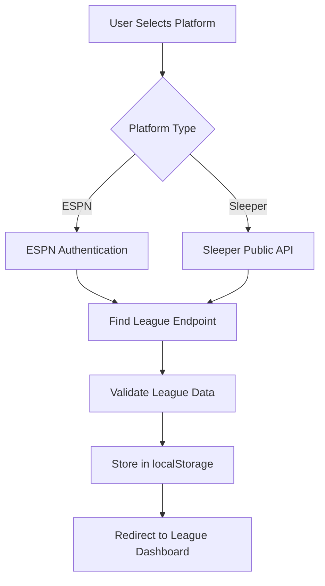
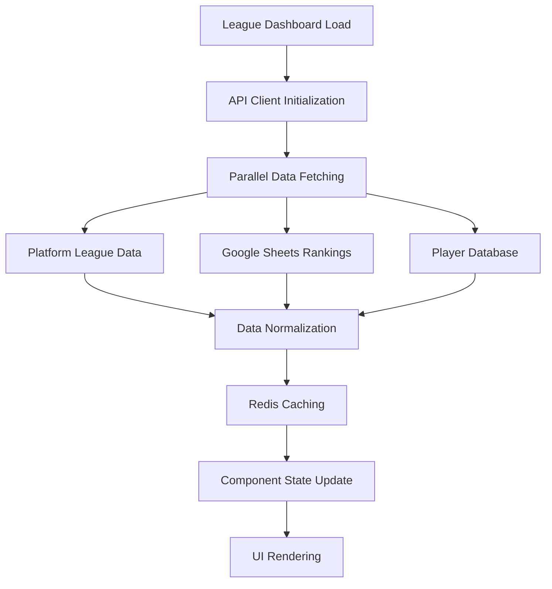
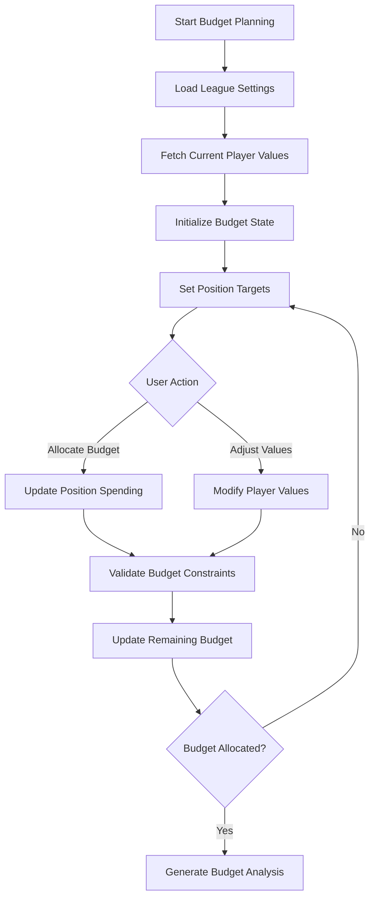

# Draft Builder - System Architecture

## Architecture Overview

Draft Builder follows a modern **Next.js App Router architecture** with server-side rendering, API routes, and client-side state management. The system is designed for scalability, maintainability, and optimal performance for fantasy football draft preparation workflows.

## Application Structure

### Next.js App Router Organization

```
src/app/
├── layout.tsx              # Root layout with global styles and navigation
├── page.tsx                # Home page with platform login options
├── globals.css             # Global TailwindCSS styles
├── navigation.tsx          # Navigation utilities and league activation
├── leagueInputs.tsx        # Shared league input components
├── EspnLogin.tsx           # ESPN authentication component
├── SleeperLogin.tsx        # Sleeper authentication component
├── storage/                # Browser storage utilities
├── api/                    # API route handlers
│   ├── ApiClient.ts        # Centralized API client
│   ├── interface.ts        # API response interfaces
│   ├── utils.ts            # API utility functions
│   ├── Decoder.ts          # Data validation and transformation
│   ├── find-league/        # League discovery endpoints
│   ├── fetch-league/       # League data retrieval
│   ├── fetch-players/      # Player data endpoints
│   ├── fetch-draft/        # Draft data retrieval
│   ├── fetch-league-history/  # Historical league data
│   └── fetch-league-teams/ # Team roster endpoints
├── league/[leagueID]/      # Dynamic league-specific routes
│   ├── layout.tsx          # League-specific layout with sidebar
│   ├── page.tsx            # League overview dashboard
│   ├── mocks/              # Auction budget planning functionality
│   │   ├── page.tsx        # Budget planning listing
│   │   ├── [mock]/         # Individual budget planning routes
│   │   └── MockDraft.tsx   # Auction budget planning engine component
│   └── drafts/             # Actual auction draft analysis
└── demo/                   # Demo functionality for new users
```

## Component Architecture

### UI Component Hierarchy

```
src/ui/
├── basicComponents.tsx     # Primitive UI elements (buttons, inputs)
├── LoadingScreen.tsx       # Loading states and task management
├── ErrorScreen.tsx         # Error handling and display
├── Sidebar.tsx             # Navigation sidebar for league context
├── TabContainer.tsx        # Tab-based navigation component
├── DropdownMenu.tsx        # Dropdown selection components
├── Tooltip.tsx             # Interactive tooltip system
├── Collapsible.tsx         # Expandable content sections
└── tests/                  # Component unit tests
```

### Component Design Patterns

#### 1. Container-Presenter Pattern
- **Containers**: Handle data fetching and state management
- **Presenters**: Pure components focused on rendering and user interaction
- **Example**: `MockDraft.tsx` (container) manages auction budget data, UI components handle display

#### 2. Compound Components
- **TabContainer**: Manages multiple tab content with shared state
- **DropdownMenu**: Combines trigger, menu, and option components
- **LoadingScreen**: Wraps content with loading task management

#### 3. Custom Hooks Pattern
- **useLocalStorage**: Browser storage abstraction
- **useApiClient**: Centralized API interaction
- **useLoadingTasks**: Task-based loading state management

## Data Flow Architecture

### 1. Authentication & League Discovery Flow



### 2. Data Aggregation Flow



### 3. Auction Budget Planning Flow



## API Endpoint Organization

### RESTful Route Structure

#### `/api/find-league/`
**Purpose**: League discovery and validation
- **Method**: POST
- **Input**: Platform credentials and league identifier
- **Output**: League metadata and validation status
- **Caching**: No caching (real-time validation)

#### `/api/fetch-league/`
**Purpose**: Complete league data retrieval
- **Method**: GET
- **Parameters**: `leagueId`, `platform`
- **Output**: League settings, roster requirements, scoring config
- **Caching**: 1-hour Redis cache

#### `/api/fetch-players/`
**Purpose**: Platform-specific player database
- **Method**: GET
- **Parameters**: `platform`, `season`
- **Output**: Normalized player data with IDs and metadata
- **Caching**: 24-hour Redis cache

#### `/api/fetch-draft/`
**Purpose**: Draft history and pick analysis
- **Method**: GET
- **Parameters**: `leagueId`, `draftId`
- **Output**: Draft picks, timing, and participant data
- **Caching**: 6-hour Redis cache (drafts change infrequently)

#### `/api/fetch-league-teams/`
**Purpose**: Team rosters and ownership data
- **Method**: GET
- **Parameters**: `leagueId`, `week?`
- **Output**: Current rosters, bench players, IR slots
- **Caching**: 30-minute Redis cache

#### `/api/fetch-league-history/`
**Purpose**: Historical league performance data
- **Method**: GET
- **Parameters**: `leagueId`, `seasons[]`
- **Output**: Past winners, standings, draft history
- **Caching**: 24-hour Redis cache

## Platform Integration Architecture

### Abstract Platform Interface

```typescript
interface PlatformApi {
  findLeague(credentials: PlatformCredentials): Promise<LeagueData>;
  fetchPlayers(season: string): Promise<PlayerData[]>;
  fetchDraft(leagueId: string): Promise<DraftData>;
  fetchTeams(leagueId: string): Promise<TeamData[]>;
}
```

### ESPN Integration (`src/platforms/espn/`)

```
espn/
├── league.ts              # ESPN-specific data models
├── api.ts                 # ESPN API client implementation
├── auth.ts                # Cookie-based authentication
├── transforms.ts          # ESPN → Internal data transformation
└── constants.ts           # ESPN-specific constants and mappings
```

**Key Features**:
- **Authentication**: Cookie-based auth for private leagues
- **Rate Limiting**: Built-in request throttling
- **Data Transformation**: ESPN IDs → Internal player IDs
- **Error Handling**: ESPN-specific error codes and recovery

### Sleeper Integration (`src/platforms/sleeper/`)

```
sleeper/
├── api.ts                 # Sleeper API client
├── types.ts               # Sleeper data models
├── transforms.ts          # Sleeper → Internal transformation
└── constants.ts           # Position mappings and configurations
```

**Key Features**:
- **Public API**: No authentication required
- **Player Database**: Comprehensive player ID system
- **Real-time Data**: Live draft and roster updates
- **Position Handling**: Complex position eligibility rules

### Google Sheets Integration (`src/rankings/sources/sleeper.tsx`)

**Architecture Components**:
1. **Sheet Discovery**: Automatically finds latest data sheet by date
2. **CSV Download**: Converts Google Sheets to CSV format
3. **Data Parsing**: Papa Parse library for CSV processing
4. **Rankings Generation**: Transforms ADP data into internal rankings
5. **Caching Strategy**: 24-hour cache for processed rankings

**Data Pipeline**:
```
Google Sheets → CSV Export → Papa Parse → Ranking Algorithms → Redis Cache → Component State
```

## Caching Strategy

### Redis Implementation (`src/redis/redis.ts`)

```typescript
// Environment-based Redis configuration
const isDevelopment = process.env.NODE_ENV === 'development';
const redis = new Redis(process.env.KV_URL!, {
  tls: isDevelopment ? undefined : { rejectUnauthorized: true }
});
```

### Cache Key Patterns

- **League Data**: `league:{platform}:{leagueId}`
- **Player Data**: `players:{platform}:{season}`
- **Rankings**: `rankings:{source}:{date}`
- **Draft Data**: `draft:{leagueId}:{draftId}`
- **User Preferences**: `user:{sessionId}:preferences`

### Cache TTL Strategy

| Data Type | TTL | Reasoning |
|-----------|-----|-----------|
| League Settings | 1 hour | Rarely change during season |
| Player Database | 24 hours | Updated weekly during season |
| Rankings/ADP | 24 hours | Daily updates from Google Sheets |
| Draft Data | 6 hours | Static after draft completion |
| Team Rosters | 30 minutes | Change frequently during waivers |

## State Management

### Client-Side State Architecture

#### 1. React Context for Global State
- **League Context**: Currently active league and settings
- **User Preferences**: UI settings, display options
- **Draft State**: Mock draft progress and selections

#### 2. Component State for Local Data
- **Form Inputs**: Login forms, search filters
- **UI State**: Modal visibility, loading states
- **Temporary Data**: Draft picks, player selections

#### 3. Browser Storage for Persistence
- **localStorage**: League history, user preferences
- **sessionStorage**: Temporary draft state, form data
- **Cookies**: Authentication tokens (ESPN)

### State Flow Patterns

```typescript
// Global state flow
UserAction → Component → Context → API Call → Cache Update → UI Rerender

// Local state flow  
UserInput → Component State → Immediate UI Update → Optional API Sync
```

## Performance Optimization

### Server-Side Optimizations

1. **API Route Caching**: Redis-based response caching
2. **Data Transformation**: Server-side normalization reduces client processing
3. **Parallel Requests**: Simultaneous API calls to external services
4. **Response Compression**: gzip compression for large datasets

### Client-Side Optimizations

1. **Code Splitting**: Next.js automatic route-based splitting
2. **Image Optimization**: Next.js Image component with WebP conversion
3. **Lazy Loading**: Components loaded on-demand
4. **Memoization**: React.memo for expensive components

### Critical Performance Paths

1. **League Loading**: Initial league data fetch and display
2. **Budget Planning Rendering**: Large player value tables with real-time budget calculations
3. **Value Updates**: Processing and displaying updated auction value and ADP data
4. **Platform Switching**: Seamless transition between ESPN/Sleeper

## Error Handling & Resilience

### Error Boundaries

```typescript
// Component-level error handling
<ErrorBoundary fallback={<ErrorScreen />}>
  <AuctionBudgetPlanningEngine />
</ErrorBoundary>
```

### API Error Handling

1. **Network Errors**: Retry logic with exponential backoff
2. **Authentication Errors**: Automatic re-authentication flow
3. **Rate Limiting**: Queue-based request management
4. **Data Validation**: Schema validation with meaningful error messages

### Graceful Degradation

- **Offline Mode**: Cached data when APIs unavailable
- **Partial Data**: Display available information when some APIs fail
- **Fallback Rankings**: Default rankings when Google Sheets unavailable
- **Mock Functionality**: Demo mode when no league connected

## Security Considerations

### Data Protection

1. **Environment Variables**: Sensitive keys stored securely
2. **API Key Management**: Rotation and access controls
3. **User Data**: No persistent storage of personal information
4. **Authentication**: Platform-specific secure auth flows

### Input Validation

1. **League IDs**: Numeric validation and sanitization
2. **API Responses**: Schema validation before processing
3. **User Inputs**: XSS prevention and input sanitization
4. **File Uploads**: (Future) CSV validation and virus scanning

This architecture documentation provides the technical foundation for understanding how Draft Builder's components, data flows, and integrations work together to deliver the fantasy football draft preparation experience. 