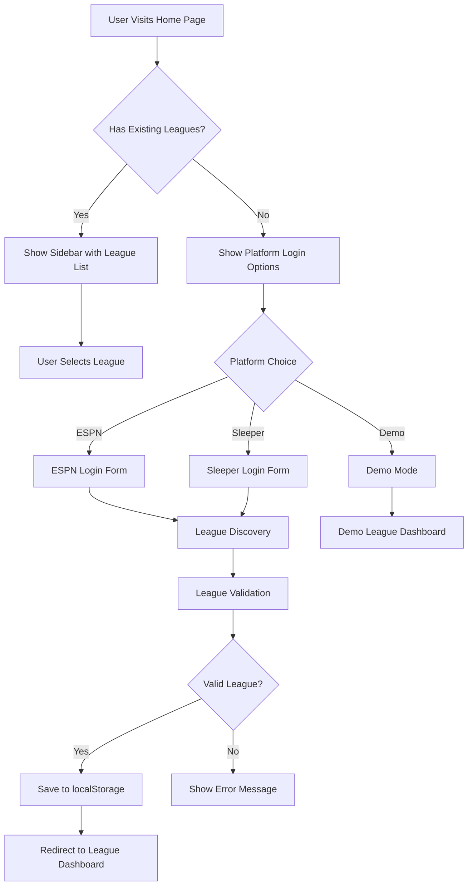
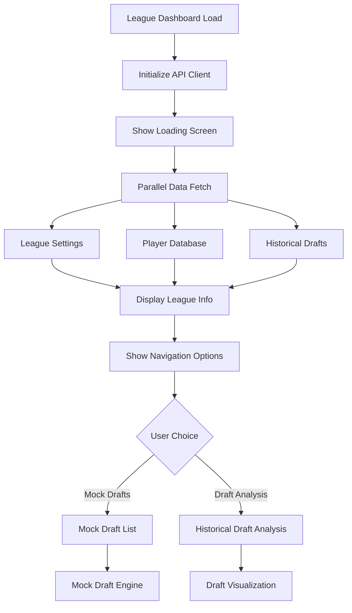
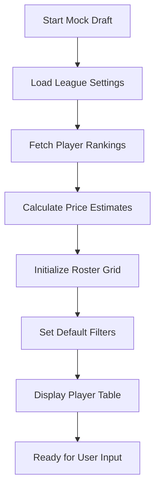
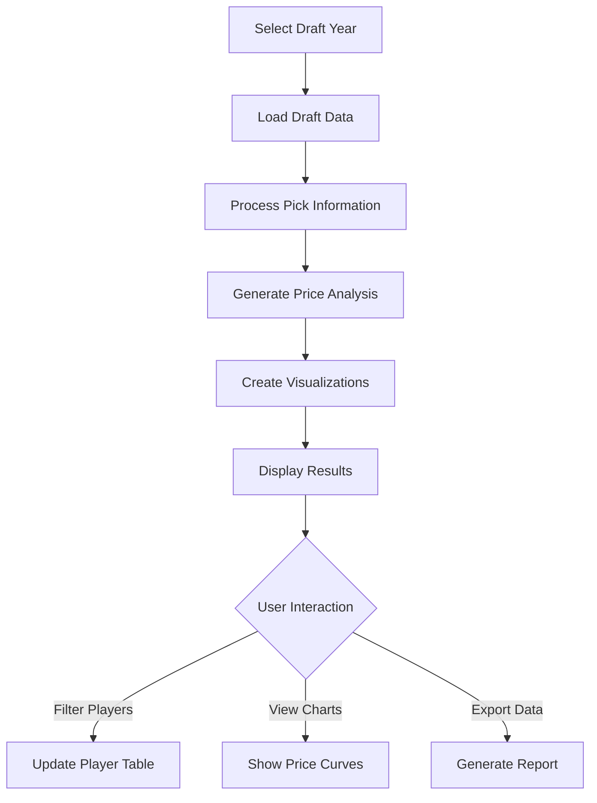

# User Interface Flows

## Overview
This document outlines the key user journeys and interface flows within Draft Builder. The application is designed around clear user workflows that guide users from league connection through draft preparation and analysis.

## Primary User Journeys

### 1. League Connection Flow

#### Initial Access


#### Platform-Specific Flows

**ESPN Authentication**:
1. **League ID Input**: Users enter ESPN league ID
2. **Public/Private Detection**: System determines if league requires authentication
3. **Cookie Entry** (if private): Users manually enter `espn_s2` and `SWID` cookies
4. **Validation**: Test API access with provided credentials
5. **Success**: Store league configuration and redirect

**Sleeper Authentication**:
1. **League ID Input**: Users enter Sleeper league ID
2. **Direct Validation**: No authentication required for most leagues
3. **Success**: Store league configuration and redirect

#### Error Handling
- **Invalid League ID**: Clear error message with format examples
- **Authentication Failure**: Guidance on cookie extraction for ESPN
- **API Unavailability**: Graceful degradation with retry options

### 2. Draft Preparation Workflow

#### League Dashboard Landing


#### Data Loading Process
The application uses a task-based loading system:

```typescript
// LoadingTask management
const tasks = new Set([
    new LoadingTask(leagueRequest, 'Fetching League'),
    new LoadingTask(playersRequest, 'Loading Players'),
    new LoadingTask(rankingsRequest, 'Fetching Rankings')
]);
```

**Loading Phases**:
1. **League Configuration**: Basic league settings and rules
2. **Player Database**: Platform-specific player data with IDs
3. **Historical Data**: Past draft results for price prediction
4. **Rankings Integration**: External ranking data from Google Sheets
5. **Budget Analysis**: Price predictions and value calculations

### 3. Mock Draft Execution

#### Mock Draft Initialization


#### Interactive Draft Process
The mock draft interface supports real-time interaction:

**Player Selection Flow**:
1. **Player Search/Filter**: Users narrow down player pool
2. **Player Selection**: Click to add player to roster
3. **Position Assignment**: System assigns to optimal roster spot
4. **Budget Update**: Real-time budget and availability recalculation
5. **Player Pool Refresh**: Remove selected players, update filters

**Budget Management**:
```typescript
// Real-time budget tracking
useEffect(() => {
    setBudgetSpent(calculateAmountSpent(costPredictor, rosterSpots, selectedPlayers, costAdjustments))
}, [costPredictor, selectedPlayers, costAdjustments, rosterSpots]);
```

#### Advanced Features
- **Cost Adjustments**: Manual price modifications for specific players
- **Multiple Rankings**: Switch between different ranking sources
- **Estimation Settings**: Configure prediction weights and historical years
- **Save/Load Drafts**: Persistent draft state management

### 4. Analytics and Reporting Views

#### Historical Draft Analysis


**Analysis Components**:
- **Price Scatter Charts**: Exponential regression visualization
- **Position Analysis**: Position-specific value curves
- **Player Performance**: Individual pick analysis
- **Error Metrics**: Prediction accuracy validation

#### Search and Filtering
The application provides comprehensive filtering options:

```typescript
// Search settings state
interface SearchSettingsState {
    positions: string[];      // Position filter
    playerCount: number;      // Results limit
    minPrice: number;         // Minimum price filter
    maxPrice: number;         // Maximum price filter
    showOnlyAvailable: boolean; // Budget constraint filter
}
```

**Filter Categories**:
- **Position Filtering**: Multi-select position checkbox system
- **Price Range**: Min/max price sliders
- **Availability**: Show only affordable players
- **Player Count**: Limit result set size

### 5. Settings and Preferences

#### Search Settings Interface
Located in `SearchSettings.tsx`, provides:
- **Position Selection**: Multi-checkbox interface with "All"/"None" shortcuts
- **Price Filtering**: Number inputs for min/max price ranges
- **Result Limiting**: Control number of displayed players
- **Real-time Updates**: Immediate filter application

#### Estimation Settings Interface
Located in `EstimationSettings.tsx`, controls:
- **Historical Years**: Checkbox selection of draft years to include
- **Ranking Weight**: Slider for overall vs positional ranking balance
- **Tooltips**: Contextual help for complex settings

## Navigation Patterns

### Application Structure
```
Home Page (/)
├── Platform Login Tabs
│   ├── ESPN Login Form
│   └── Sleeper Login Form
└── Demo Link

League Dashboard (/league/[leagueID])
├── League Overview
├── Mock Drafts (/league/[leagueID]/mocks)
│   ├── Draft List
│   └── Individual Mock (/league/[leagueID]/mocks/[mock])
└── Draft Analysis (/league/[leagueID]/drafts/[draftYear])
```

### Sidebar Navigation
The `Sidebar.tsx` component provides:
- **League Switching**: Dropdown menu for available leagues
- **Collapsible Design**: Responsive collapse/expand behavior
- **Platform Icons**: Visual identification of league platforms
- **Active State**: Highlights current league selection

### Tab-Based Interfaces
Many views use `TabContainer.tsx` for organization:
- **Platform Selection**: Home page login options
- **Chart Views**: Draft analysis visualizations
- **Data Views**: Different perspectives on the same dataset

## State Management Patterns

### Local State Management
Each major component manages its own state:

```typescript
// MockTable.tsx state management
const [searchSettings, setSearchSettings] = useState<SearchSettingsState>(defaultSearchSettings);
const [estimationSettings, setEstimationSettings] = useState<EstimationSettingsState>(defaultEstimationSettings);
const [selectedPlayers, setSelectedPlayers] = useState<RankedPlayer[]>([]);
const [budgetSpent, setBudgetSpent] = useState(0);
```

### Persistence Patterns
- **localStorage**: League configurations, draft progress, user preferences
- **Session State**: Temporary UI state, form inputs
- **URL Parameters**: League ID, draft year, deep linking support

### Effect Dependencies
The application uses careful effect dependency management:

```typescript
// Budget recalculation effect
useEffect(() => {
    setBudgetSpent(calculateAmountSpent(costPredictor, rosterSpots, selectedPlayers, costAdjustments))
}, [costPredictor, selectedPlayers, costAdjustments, rosterSpots]);
```

## Loading States and Error Handling

### Progressive Loading
The application shows data as it becomes available:
1. **Initial Layout**: Static page structure loads immediately
2. **Cached Data**: Previously stored league info displays quickly
3. **Fresh Data**: API responses update interface progressively
4. **Complete State**: All data loaded, full functionality available

### Error Recovery
- **Network Errors**: Retry mechanisms with user feedback
- **Data Errors**: Graceful degradation and alternative data sources
- **User Errors**: Clear error messages with corrective guidance
- **API Limits**: Rate limiting awareness and backoff strategies

## Responsive Design Considerations

### Mobile Optimization
- **Touch-Friendly**: Large touch targets for mobile devices
- **Responsive Layouts**: Adaptive grid systems for different screen sizes
- **Sidebar Behavior**: Collapsible navigation for mobile viewports
- **Table Optimization**: Horizontal scrolling for large data tables

### Desktop Enhancements
- **Keyboard Navigation**: Full keyboard accessibility
- **Mouse Interactions**: Hover states and context menus
- **Multiple Monitors**: Optimal use of large screen real estate
- **Power User Features**: Keyboard shortcuts and advanced controls

## Accessibility Features

### Screen Reader Support
- **Semantic HTML**: Proper heading hierarchy and landmark roles
- **ARIA Labels**: Descriptive labels for complex interactions
- **Focus Management**: Logical tab order and focus indicators
- **Status Updates**: Live regions for dynamic content changes

### Keyboard Navigation
- **Tab Order**: Logical progression through interactive elements
- **Shortcut Keys**: Quick access to common functions
- **Focus Indicators**: Clear visual focus states
- **Modal Handling**: Proper focus trapping in overlays

## Performance Optimizations

### Efficient Rendering
- **Virtualization**: Large tables handle hundreds of players efficiently
- **Memoization**: Expensive calculations cached and reused
- **Selective Updates**: Only affected components re-render on state changes
- **Lazy Loading**: Components and data loaded on demand

### Network Optimization
- **Caching**: API responses cached in Redis and browser storage
- **Parallel Requests**: Multiple data sources fetched simultaneously
- **Request Deduplication**: Prevent duplicate API calls
- **Compression**: Large datasets compressed for transmission

## Future Enhancements

### Planned UI Improvements
1. **Drag and Drop**: Direct player manipulation for roster building
2. **Real-time Collaboration**: Shared mock drafts with multiple users
3. **Advanced Filtering**: Saved filter presets and complex queries
4. **Dashboard Customization**: User-configurable layout and widgets

### Technical Improvements
1. **State Management**: Consider Redux or Zustand for complex state
2. **Performance**: Implement virtual scrolling for large player lists
3. **Offline Support**: Service worker for offline draft functionality
4. **Progressive Web App**: Enhanced mobile experience with PWA features 